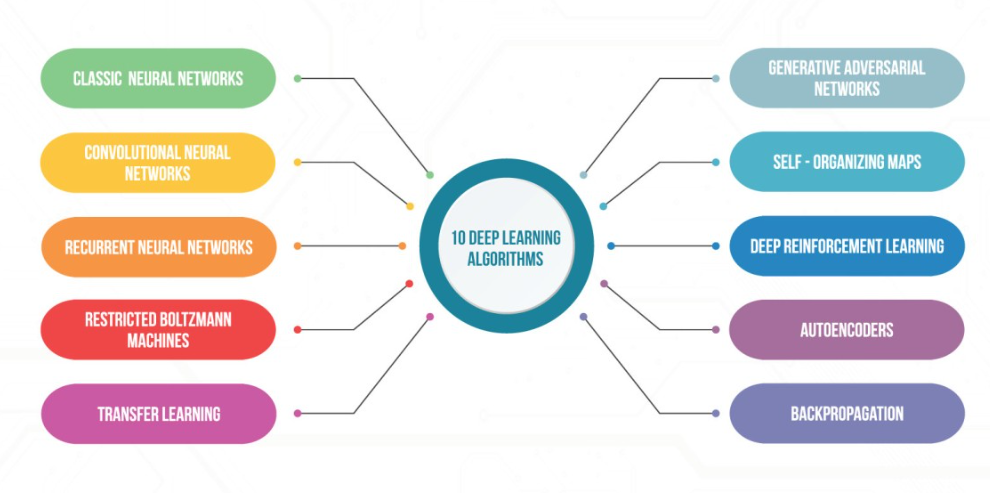

# 100 Days of Deep Learning

  

    
This repository is a collection of code, resources, and notes for the "100 Days of Deep Learning" playlist from CampusX. The original content and structure are credited to CampusX, and I highly recommend checking out their playlist(https://youtu.be/2dH_qjc9mFg?si=1WEuCfzv4bzaqE6M) for in-depth learning on various deep learning topics.

  

  

  

## Overview

The "100 Days of Deep Learning" series is a comprehensive guide that covers a wide range of deep learning concepts, frameworks, and applications. The original content in this repository is derived from CampusX's fantastic work in providing educational content on deep learning.

## My Contributions

In addition to the original content, I have added some extra materials, examples, and explanations to enhance the learning experience. These additions aim to provide further clarification, practical insights, and additional resources to complement the existing curriculum.

## Daily Topics

- **Day 1:**
  - Overview of Deep Learning
- **Day 2:**
  - What is Deep Learning?
  - Deep Learning Vs Machine Learning
- **Day 3:**
  - Types of Neural Networks
  - History of Deep Learning
  - Applications of Deep Learning
- **Day 4:**
  - What is a Perceptron?
  - Perceptron Vs Neuron
  - Perceptron Geometric Intuition
- **Day 5:**
  - Perceptron Trick
  - How to train a Perceptron
  - Perceptron Part 2
- **Day 6:**
  - Perceptron Loss Function
  - Hinge Loss
  - Binary Cross Entropy
  - Sigmoid Function
- **Day 7:**
  - Problem with Perceptron
- **Day 8:**
  - MLP Notation
- **Day 9:**
  - Multi Layer Perceptron
  - MLP Intuition
- **Day 10:**
  - Forward Propagation
  - How a neural network predicts output?
- **Day 11:**
  - Deep Learning Classification
	- Customer Churn Prediction using ANN  
- **Day 12:**
  - MNIST Dataset
   - Handwritten Digit Classification using ANN
- **Day 13:**
  - Forward Propagation
  - How a neural network predicts output?
- **Day 14:**
  - Graduate Admission Prediction using ANN
- **Day 15:**
  - Loss Functions in Deep Learning
- **Day 16:**
  - Backpropagation in Deep Learning (Part 1)
	- The What Backpropagation is?
- **Day 17:**
  - Backpropagation in Deep Learning (Part 2)
	- The How Backpropagation is?
- **Day 18:**
  - Backpropagation in Deep Learning (Part 3)
	- The Why Backpropagation is?
- **Day 19:**
  - Gradient Descent in Neural Networks
	- Batch Gradient Descent
	- Mini Batch Gradient Descent
	- Stochastics Gradient Descent
	- Batch vs Stochastics vs Mini Batch Gradient Descent
- **Day 20:**
  - Problems in ANN
   - Vanishing Gradient Problem in ANN
   - Exploding Gradient Problem in ANN

  
- **Day 21:**
  - How to Improve the Performance of a Neural Network
	- Fine Tuning Of Hyper Prameters
	- By Solving Problems
		- Vanishing Gradient Problem
		- Exploding Gradient Problem		
- **Day 22:**
  - Fine Tuning Of Hyper Prameters
	- Early Stopping In Neural Networks
- **Day 23:**
  - Data Scaling in Neural Network
	- Feature Scaling in ANN

	
  
  
  
## Acknowledgments

**CampusX:** Thank you for creating the "100 Days of Deep Learning" playlist and providing valuable educational content.

